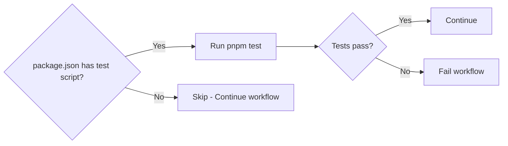
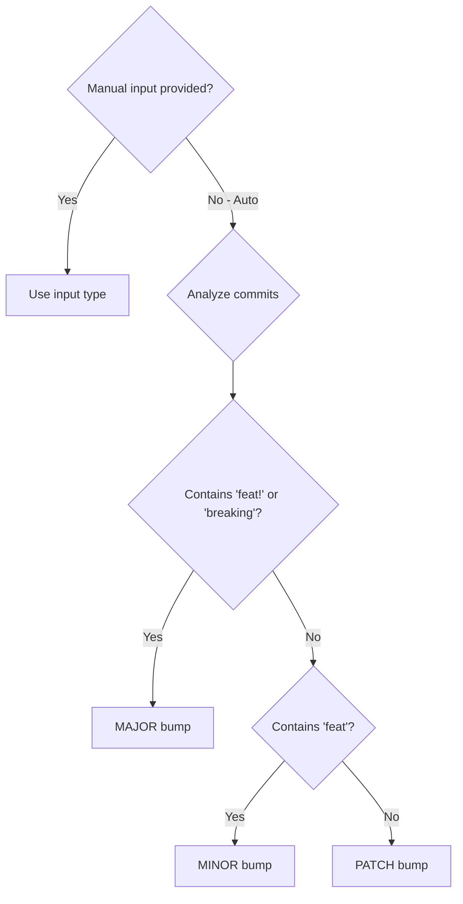
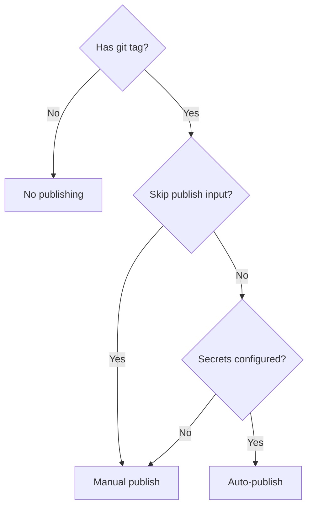

# Production Release Workflow Diagram

```mermaid
flowchart TD
    Start([Push to Main Branch]) --> Trigger{Workflow Triggered}
    
    Trigger --> TestJob[Test Job]
    TestJob --> CheckTests{Tests Configured?}
    CheckTests -->|Yes| RunTests[Run pnpm test]
    CheckTests -->|No| SkipTests[Skip Tests]
    RunTests --> TestResult{Tests Pass?}
    TestResult -->|No| FailWorkflow[❌ Workflow Fails]
    TestResult -->|Yes| VersionBump
    SkipTests --> VersionBump
    
    VersionBump[Version Bump Job]
    VersionBump --> CheckSkip{Skip Version Bump?}
    CheckSkip -->|Yes| UseCurrentVersion[Use Current Version]
    CheckSkip -->|No| AnalyzeCommits[Analyze Commit Messages]
    
    AnalyzeCommits --> DetectType{Commit Type}
    DetectType -->|feat!: or breaking:| BumpMajor[Major: 1.0.0 → 2.0.0]
    DetectType -->|feat: or feature:| BumpMinor[Minor: 1.0.0 → 1.1.0]
    DetectType -->|fix:, chore:, etc.| BumpPatch[Patch: 1.0.0 → 1.0.1]
    
    BumpMajor --> UpdatePackage[Update package.json]
    BumpMinor --> UpdatePackage
    BumpPatch --> UpdatePackage
    
    UpdatePackage --> CommitVersion[Commit Version Bump]
    CommitVersion --> CreateTag[Create Git Tag]
    CreateTag --> PushTag[Push Tag to Repo]
    
    PushTag --> BuildJob
    UseCurrentVersion --> BuildJob
    
    BuildJob[Build & Release Job]
    BuildJob --> SetupEnv[Setup Build Environment]
    SetupEnv --> CreateProdEnv[Create .env.production]
    CreateProdEnv --> RunBuild[Run pnpm build:prod]
    
    RunBuild --> BuildSuccess{Build Success?}
    BuildSuccess -->|No| FailWorkflow
    BuildSuccess -->|Yes| CreateZip[Create ZIP Package]
    
    CreateZip --> UploadArtifact[Upload Build Artifact]
    UploadArtifact --> CreateRelease{Has Tag?}
    
    CreateRelease -->|Yes| GitHubRelease[Create GitHub Release]
    CreateRelease -->|No| EndNoRelease[End - No Release]
    
    GitHubRelease --> CheckCWS{Chrome Web Store\nConfigured?}
    CheckCWS -->|No| ManualPublish[📦 Manual Publishing Required]
    CheckCWS -->|Yes| CheckSkipPublish{Skip Publish\nOption?}
    
    CheckSkipPublish -->|Yes| ManualPublish
    CheckSkipPublish -->|No| AutoPublish[🚀 Auto-Publish to CWS]
    
    AutoPublish --> PublishResult{Publish Success?}
    PublishResult -->|Yes| Success[✅ Complete Success]
    PublishResult -->|No| PublishFailed[⚠️ Manual Upload Needed]
    
    ManualPublish --> Success
    PublishFailed --> Success
    
    Success --> End([Workflow Complete])
    EndNoRelease --> End
    FailWorkflow --> End

    style Start fill:#e1f5e1
    style End fill:#e1f5e1
    style Success fill:#90EE90
    style FailWorkflow fill:#ffcccc
    style PublishFailed fill:#ffe5b4
    style ManualPublish fill:#ffe5b4
    style AutoPublish fill:#b4d7ff
    style GitHubRelease fill:#b4d7ff
```



## Workflow Jobs Breakdown

### 1️⃣ Test Job
**Purpose:** Validate code quality before release

- ✅ Checkout repository
- ✅ Setup Node.js and pnpm
- ✅ Install dependencies
- ✅ Run tests (if configured)
- ❌ Fail workflow if tests fail

**Skip if:** No tests configured (continues workflow)

---

### 2️⃣ Version Bump Job
**Purpose:** Automatically determine and apply version bump

**Steps:**
1. **Analyze Commits** - Get all commits since last tag
2. **Determine Type** - Parse commit messages:
   - `feat!:` → Major bump
   - `feat:` → Minor bump  
   - `fix:` → Patch bump
3. **Update Files** - Modify `package.json` version
4. **Create Tag** - Generate `vX.Y.Z` tag
5. **Push** - Commit and push tag to repository

**Skip if:** `skip-version-bump` input is true

**Outputs:**
- `new-version` - e.g., "1.2.3"
- `new-tag` - e.g., "v1.2.3"

---

### 3️⃣ Build & Release Job
**Purpose:** Create production bundle and publish

**Build Steps:**
1. Checkout at specific tag
2. Install dependencies
3. Create `.env.production` with production URLs
4. Run `pnpm build:prod`
5. Create ZIP from `build/chrome-mv3-prod/`

**Artifact Upload:**
- Name: `chrome-extension-vX.Y.Z`
- Contains: Build folder + ZIP file
- Retention: 90 days

**GitHub Release:**
- Creates only if tag exists
- Attaches ZIP file
- Auto-generates release notes
- Marks as non-draft, non-prerelease

**Chrome Web Store Publishing:**
- Runs only if:
  - Tag exists
  - Not skipped via input
  - Secrets configured
- Uses `mobilefirstllc/cws-publish` action
- Continues workflow on failure

---

## Workflow Triggers

### Automatic Trigger
```yaml
on:
  push:
    branches:
      - main
```
**When:** Any push to `main` branch
**Use case:** Normal development flow

### Manual Trigger
```yaml
workflow_dispatch:
  inputs:
    skip-version-bump: boolean
    version-type: choice
    skip-publish: boolean
```
**When:** Via GitHub Actions UI
**Use cases:**
- Hotfix releases
- Custom version control
- Testing workflow
- Publishing without version bump

---

## Decision Points

### Should Run Tests?


### How to Bump Version?


### Should Publish to CWS?


---

## Artifacts Generated

### Build Artifacts (All Runs)
📦 **Stored for 90 days**
- `build/chrome-mv3-prod/` - Unpacked extension
- `comment-verdict-chrome-extension-vX.Y.Z.zip` - Distribution package

### GitHub Release (Tag Runs Only)
🏷️ **Permanent**
- Tag: `vX.Y.Z`
- Title: "Release X.Y.Z"
- Body: Auto-generated release notes
- Asset: ZIP file for download

### Chrome Web Store (If Configured)
🌐 **Live Publication**
- Uploaded to Chrome Web Store
- Pending review by Google
- Published when approved

---

## Success Scenarios

### ✅ Full Success Path
1. Tests pass ✓
2. Version bumped: 1.0.0 → 1.1.0 ✓
3. Tag created: v1.1.0 ✓
4. Build succeeds ✓
5. GitHub release created ✓
6. Chrome Web Store published ✓

### ⚠️ Partial Success Paths

**Scenario 1: No Tests**
1. Tests skipped (not configured) ⊘
2. Everything else succeeds ✓

**Scenario 2: Skip Version Bump**
1. Use current version ⊘
2. No tag created ⊘
3. Build succeeds ✓
4. Artifacts uploaded ✓
5. No GitHub release (no tag) ⊘

**Scenario 3: Publishing Fails**
1. Tests pass ✓
2. Build succeeds ✓
3. Release created ✓
4. CWS publish fails ⚠️
5. Manual upload required 📦

---

## Environment Variables

### Build Time
- `NODE_ENV=production`
- `COMMENT_VERDICT_DEBUG=0`
- API URLs from `.env.production`

### Runtime Secrets (Optional)
- `CHROME_EXTENSION_ID` - For auto-publishing
- `CHROME_CLIENT_ID` - OAuth client
- `CHROME_CLIENT_SECRET` - OAuth secret
- `CHROME_REFRESH_TOKEN` - OAuth token
- `GITHUB_TOKEN` - Auto-provided by Actions

---

## Error Handling

| Error | Job | Behavior | Recovery |
|-------|-----|----------|----------|
| Tests fail | Test | ❌ Stop workflow | Fix tests and push |
| Build fails | Build | ❌ Stop workflow | Fix build issues |
| Tag exists | Version Bump | ❌ Stop workflow | Delete tag or skip bump |
| CWS publish fails | Build | ⚠️ Continue | Manual upload |
| No secrets | Build | ⚠️ Skip publish | Manual upload |

---

## Monitoring

### Check Workflow Status
1. Go to repository **Actions** tab
2. Select **Production Release** workflow
3. View runs with status indicators:
   - 🟢 Success
   - 🔴 Failed
   - 🟡 In Progress
   - ⚪ Skipped

### View Logs
1. Click on any workflow run
2. Expand job steps
3. Read detailed console output
4. Download artifacts if needed
